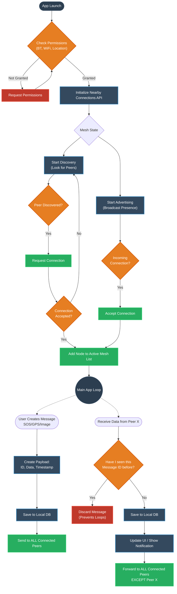

# Offline Mesh Application Architecture

Here is the detailed flowchart demonstrating how the peer-to-peer mesh networking logic operates, specifically focusing on how devices connect and how messages propagate without infinite loops.

### Key Mechanisms Explained:
1. **Continuous Discovery/Advertising:** Every phone runs both simultaneously. This is what makes it a "Mesh". Everyone is looking for everyone else.
2. **Flooding Algorithm:** When a message is sent or received, it is "flooded" (sent) to every single person you are currently connected to. 
3. **Loop Prevention (Critical):** Because of flooding, a message will bounce around the network. The `Have I seen this Message ID before?` check is the most important part of the mesh. If Node A sends to Node B, and Node B forwards to Node C, Node C will try to forward it back to Node A. Node A must recognize the ID and drop it to stop an infinite loop.
